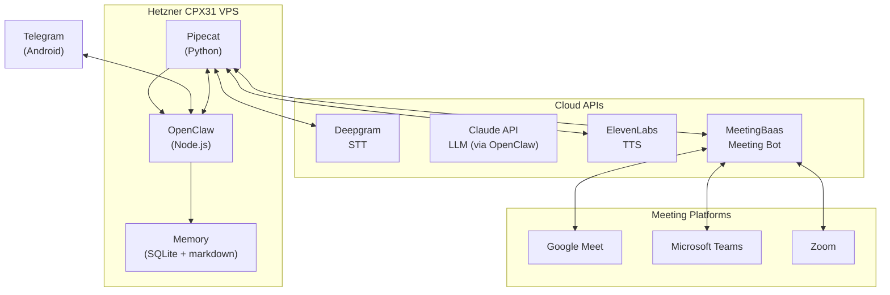
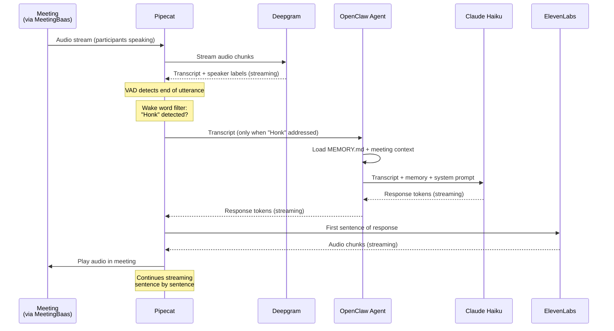
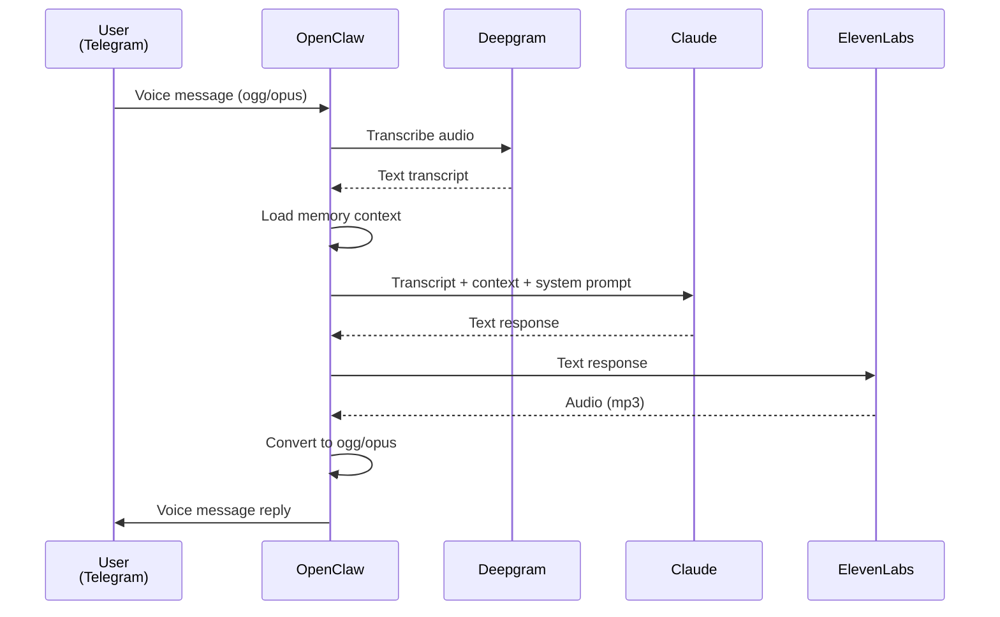
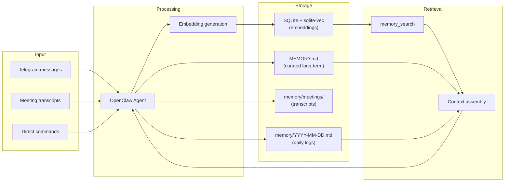

# Architecture

HonkAssist is a self-hosted voice AI assistant built on two main processes running on a Hetzner VPS, backed by cloud APIs for speech and language processing.

## High-Level System Diagram



## Component Breakdown

### OpenClaw (Agent Brain)

**Role:** Orchestration, memory management, Telegram interface, agent personality.

- Runs as a Node.js process via `openclaw gateway`
- Handles all Telegram messages (text and voice)
- Manages persistent memory (MEMORY.md, daily files, SQLite embeddings)
- Routes meeting join commands to Pipecat/MeetingBaas
- Processes post-meeting transcripts into memory
- Configured via `openclaw.json` with agent identity in `SOUL.md`

**Why OpenClaw?** Purpose-built agent framework with built-in memory, Telegram plugin, and multi-agent support. No need to build orchestration from scratch.

### Pipecat (Voice Pipeline)

**Role:** Real-time audio processing for meetings.

- Python-based framework by Daily.co
- Manages the STT → LLM → TTS streaming pipeline
- Handles VAD (Voice Activity Detection) and turn-taking
- Connects to MeetingBaas for meeting audio
- Runs as a separate systemd service
- **LLM calls route through OpenClaw agent** (not direct Anthropic API) for persistent memory and context — see [OpenClaw Bridge Spec](specs/openclaw-bridge.md)

**Why Pipecat?** Open-source, pluggable provider architecture, optimized for streaming audio with built-in interruption handling. Apache 2.0 license.

### MeetingBaas (Meeting Connector)

**Role:** Joins meetings across platforms, routes audio bidirectionally.

- Cloud API that handles platform-specific meeting join logic
- Provides bidirectional audio streams (hear participants, speak back)
- Supports Google Meet, Microsoft Teams, Zoom
- Per-participant audio separation on supported platforms
- $0.69/hr usage-based pricing

**Why MeetingBaas?** Abstracts away the complexity of joining meetings across three different platforms. Alternative approaches (headless browser, native SDKs) are fragile or over-engineered for personal use.

### Cloud APIs

| Service | Component | Role | Why This Provider? |
|---------|-----------|------|--------------------|
| Deepgram Nova-3 | STT | Streaming speech-to-text with diarization | Fastest streaming latency (~150ms first word), lowest cost ($0.0043/min), built-in speaker diarization |
| Claude Haiku | LLM (voice) | Generate voice responses | ~660ms TTFB, strong reasoning for an assistant, consistent with text agent |
| Claude Sonnet | LLM (text) | Complex text tasks, post-meeting analysis | Better reasoning for summaries and analysis where latency isn't critical |
| ElevenLabs Flash v2.5 | TTS | Streaming text-to-speech | ~75ms model latency, high voice quality, voice cloning support |

---

## Data Flow Diagrams

### Meeting Voice Pipeline

Real-time bidirectional voice during a meeting:



**Latency budget (optimistic → realistic):**

| Stage | Optimistic | Realistic | Notes |
|-------|-----------|-----------|-------|
| Audio capture + VAD + buffering | 50ms | 100ms | VAD endpointing delay |
| STT streaming + endpointing | 150ms | 400ms | Deepgram Nova-3 |
| Network + orchestration | 20ms | 50ms | VPS to cloud APIs |
| LLM TTFT (Claude Haiku) | 660ms | 700ms | Streaming, first token |
| TTS TTFB (ElevenLabs Flash) | 75ms | 150ms | Streaming, first audio chunk |
| Audio playback buffering | 30ms | 50ms | Buffer before playback |
| **Total to first audio** | **~985ms** | **~1,450ms** | Target: <1.5s |

### Telegram Voice Message Flow

Asynchronous voice interaction via Telegram:



### Memory and Context Flow

How information persists across sessions:



---

## Technology Choices with Rationale

### Why Cascaded Pipeline (STT + LLM + TTS) vs Speech-to-Speech?

Speech-to-speech models (GPT-4o Realtime, Gemini Live) offer lower latency (~500ms) but:

- **Claude doesn't have a speech-to-speech mode** — and Claude's reasoning is the priority
- Less control over individual pipeline stages
- Can't mix best-in-class components (Deepgram STT + Claude LLM + ElevenLabs TTS)
- Harder to debug when things go wrong

The ~1.5s latency from a cascaded pipeline is acceptable for a meeting assistant that "thinks before speaking."

### Why Hetzner CPX31?

| Requirement | CPX31 Spec | Notes |
|-------------|-----------|-------|
| CPU for audio processing | 4 vCPU (AMD) | Sufficient for orchestration + encoding |
| RAM for Node.js + Python | 8 GB | Comfortable for both processes |
| Storage for memory + logs | 160 GB SSD | Years of transcripts and memory |
| Network for streaming APIs | 20 TB transfer | More than enough |
| Cost | ~€15/mo | Best value for x86 shared vCPU |

ARM (CAX) was considered but rejected due to potential Pipecat/dependency compatibility issues with x86-only packages.

### Why Not Self-Host STT/TTS?

| Factor | Cloud API | Self-Hosted |
|--------|----------|-------------|
| Latency | ~150-300ms | ~300ms (GPU), 2-5s (CPU) |
| Quality | State-of-art | Good but behind |
| GPU needed | No | Yes (for real-time) |
| Maintenance | Zero | Model updates, debugging |
| Cost at low volume | $3-10/mo | $50+/mo (GPU server) |

Cloud APIs win on every dimension at personal-use scale. Self-hosting becomes viable only at high volume with dedicated GPU infrastructure.

---

## Deployment Topology

```
┌─────────────────────────────────────────────────────────┐
│  Hetzner CPX31 (Nuremberg/Falkenstein)                  │
│  Ubuntu 24.04 LTS                                       │
│                                                         │
│  ┌──────────────────┐  ┌────────────────────────────┐   │
│  │ systemd:          │  │ systemd:                    │   │
│  │ openclaw.service  │  │ pipecat.service             │   │
│  │                   │  │                             │   │
│  │ User: openclaw    │  │ User: openclaw              │   │
│  │ Port: none (outb) │  │ Port: none (outbound only)  │   │
│  └──────────────────┘  └────────────────────────────┘   │
│                                                         │
│  ┌──────────────────┐  ┌────────────────────────────┐   │
│  │ Tailscale VPN     │  │ gocryptfs                   │   │
│  │ (SSH access only) │  │ (encrypted data at rest)    │   │
│  └──────────────────┘  └────────────────────────────┘   │
│                                                         │
│  UFW: deny all inbound (except Tailscale SSH)           │
│  fail2ban: SSH brute-force protection                   │
│  unattended-upgrades: automatic security patches        │
└─────────────────────────────────────────────────────────┘
         │
         │ Tailscale VPN
         ▼
    Tech user laptop (SSH management)
```

All external communication is **outbound only** — no ports exposed to the public internet. Telegram Bot API, MeetingBaas, Deepgram, Claude, and ElevenLabs are all reached via outbound HTTPS/WebSocket connections.

---

## Deployment Environments

HonkAssist is designed to run on two environments:

### Production: Hetzner CPX31 VPS

```
┌─────────────────────────────────────┐
│  Hetzner CPX31 (x86, 4 vCPU, 8GB)  │
│                                     │
│  openclaw (sole agent)              │
│  pipecat (voice pipeline)           │
│  Tailscale (VPN access)             │
│  gocryptfs (encrypted data)         │
└─────────────────────────────────────┘
```

- **Purpose:** Production for end-user
- **Architecture:** x86_64 AMD
- **OpenClaw:** Single agent (HonkAssist only)
- **Network:** Tailscale VPN, no public ports

### Dev/Test: NVIDIA DGX Spark

```
┌──────────────────────────────────────────┐
│  DGX Spark (ARM64, GB10 GPU, 128GB)      │
│                                          │
│  openclaw                                │
│    ├── agent: main (Honk 🪿)             │
│    └── agent: honkassist (HonkAssist 🎙️) │
│  pipecat (voice pipeline)                │
│  vLLM (Qwen3-Next-80B, port 8080)       │
│  Tailscale (VPN access)                  │
└──────────────────────────────────────────┘
```

- **Purpose:** Development and testing
- **Architecture:** ARM64 (aarch64) — verify Pipecat ARM compatibility
- **OpenClaw:** Multi-agent (Honk main + HonkAssist)
- **Advantage:** Local LLM available (Qwen3-Next-80B) for testing without Claude API costs
- **Network:** Already on Tailscale

### Key Differences

| Aspect | Hetzner VPS | DGX Spark |
|--------|-------------|-----------|
| CPU arch | x86_64 | ARM64 |
| GPU | None | NVIDIA GB10 (Blackwell) |
| OpenClaw agents | 1 (HonkAssist) | 2+ (Honk + HonkAssist) |
| Local LLM | No | Yes (Qwen3-Next-80B) |
| System user | `openclaw` (dedicated) | `chris` (shared) |
| Fresh install | Yes | No (add agent to existing) |

See the [OpenClaw Agent Spec](specs/openclaw-agent.md) for multi-agent configuration details.

---

## Future Architecture Considerations

| Phase | Change | Trigger |
|-------|--------|---------|
| Phase 2 | Add Qdrant vector DB | Memory exceeds ~100-200 documents |
| Phase 3 | Replace MeetingBaas with LiveKit self-hosted | Cost exceeds $50/mo for meetings |
| Phase 3 | Add local Whisper for post-meeting refinement | Need better diarization accuracy |
| Future | Anthropic zero-retention API | When available/affordable |
| Future | Add Signal as secondary messenger | If user's contacts require it |
