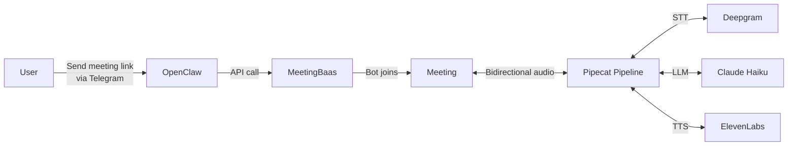
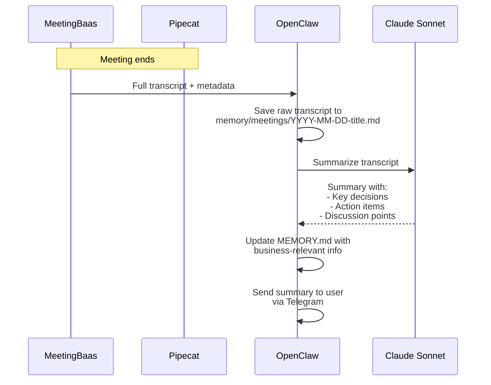

# Meeting Bot Specification

HonkAssist joins video meetings via MeetingBaas and participates with real-time voice using the Pipecat framework.

---

## Overview



**Flow:** User sends a meeting link → OpenClaw calls MeetingBaas API → bot joins the meeting → Pipecat handles real-time voice interaction → transcript saved to memory after the meeting.

---

## MeetingBaas API Integration

### Joining a Meeting

```bash
curl -X POST https://api.meetingbaas.com/bots \
  -H "Content-Type: application/json" \
  -H "x-meeting-baas-api-key: <API_KEY>" \
  -d '{
    "meeting_url": "https://meet.google.com/abc-defg-hij",
    "bot_name": "HonkAssist",
    "reserved": false,
    "speech_to_text": {
      "provider": "Default"
    },
    "bot_image": "https://example.com/honkassist-avatar.png",
    "entry_message": "HonkAssist has joined — I'\''ll be taking notes and can answer questions.",
    "deduplication_key": "meeting-2026-03-27-standup"
  }'
```

### API Response

```json
{
  "bot_id": "bot_abc123",
  "status": "joining",
  "meeting_url": "https://meet.google.com/abc-defg-hij"
}
```

### Removing the Bot

```bash
curl -X DELETE https://api.meetingbaas.com/bots/<bot_id> \
  -H "x-meeting-baas-api-key: <API_KEY>"
```

### Key Parameters

| Parameter | Value | Notes |
|-----------|-------|-------|
| `bot_name` | "HonkAssist" | Displayed to meeting participants |
| `bot_image` | URL to avatar | Shown in participant list |
| `entry_message` | Announcement text | Sent to meeting chat on join |
| `speech_to_text.provider` | "Default" | MeetingBaas built-in (or "Deepgram" for direct) |
| `reserved` | `false` | On-demand bot creation |
| `deduplication_key` | Unique per meeting | Prevents duplicate bots joining |

---

## Pipecat Framework Setup

### Pipeline Architecture

```python
from pipecat.pipeline.pipeline import Pipeline
from pipecat.services.deepgram import DeepgramSTTService
from pipecat.services.anthropic import AnthropicLLMService
from pipecat.services.elevenlabs import ElevenLabsTTSService
from pipecat.transports.services.daily import DailyTransport

# Pipeline: Transport → STT → LLM → TTS → Transport
pipeline = Pipeline([
    transport.input(),           # Audio from meeting
    deepgram_stt,                # Speech → Text
    context_aggregator.user(),   # Add to conversation context
    llm,                         # Text → Response
    tts,                         # Response → Speech
    transport.output(),          # Audio back to meeting
    context_aggregator.assistant()
])
```

### Service Configuration

**Deepgram STT:**
```python
deepgram_stt = DeepgramSTTService(
    api_key=os.getenv("DEEPGRAM_API_KEY"),
    model="nova-3",
    language="en",
    diarize=True,
    endpointing=300,
    interim_results=True
)
```

**Claude LLM:**
```python
llm = AnthropicLLMService(
    api_key=os.getenv("ANTHROPIC_API_KEY"),
    model="claude-haiku-4",
    max_tokens=200,  # Keep responses brief for voice
    system_prompt="""You are HonkAssist, an AI meeting assistant.
    - Be concise (1-3 sentences)
    - Only respond when directly addressed or when you have valuable input
    - Take note of decisions and action items
    - If unsure, say so"""
)
```

**ElevenLabs TTS:**
```python
tts = ElevenLabsTTSService(
    api_key=os.getenv("ELEVENLABS_API_KEY"),
    voice_id=os.getenv("ELEVENLABS_VOICE_ID"),
    model="eleven_flash_v2_5",
    output_format="pcm_16000"  # PCM for meeting audio
)
```

---

## Platform Support Matrix

| Platform | Status | Audio Quality | Known Issues |
|----------|--------|---------------|--------------|
| **Google Meet** | ✅ Supported | Good | Silent audio reported in some configurations (see below) |
| **Microsoft Teams** | ✅ Supported | Good | May require org admin approval for external bots |
| **Zoom** | ✅ Supported | Moderate | Sparse audio in some scenarios (see below) |
| **Webex** | ⚠️ Untested | Unknown | MeetingBaas supports it, not yet tested |

### Platform-Specific Notes

**Google Meet:**
- Web client is full-featured — best support
- Known issue: silent audio when bot microphone isn't properly initialized
- Workaround: Ensure MeetingBaas bot config has `audio=true` and `video=false`

**Microsoft Teams:**
- Works for external guest access meetings
- Organization-internal meetings may require Teams admin to allow external bots
- Bot appears as a guest participant

**Zoom:**
- Web client has limitations compared to native app
- Sparse/choppy audio reported in some configurations
- Best results with Zoom meetings that don't require the native client
- Bot must accept any "join from browser" prompts

---

## Bot Behavior

### On Join

1. Bot joins the meeting via MeetingBaas
2. Appears as "HonkAssist" in participant list
3. Sends chat message: *"HonkAssist has joined — I'll be taking notes and can answer questions."*
4. Speaks announcement: *"Hi, I'm [User]'s AI assistant. I'll be taking notes and I'm happy to help with any questions."*

### During Meeting

**When to speak:**
- Directly addressed by name ("HonkAssist, what do you think?")
- Asked a factual question the bot can answer
- Prompted to summarize or recap
- Action items are being discussed (offer to note them)

**When to stay silent:**
- General conversation between participants
- Topics where the bot has no useful input
- When another participant is answering adequately
- Small talk and pleasantries (beyond the initial greeting)

**Response style:**
- 1-3 sentences for most responses
- Factual and direct
- Acknowledge uncertainty ("I'm not sure about that, but...")
- Reference earlier points in the meeting when relevant

### On Leave

- Triggered by: user command via Telegram, meeting ends, or explicit removal
- Bot speaks: *"Thanks everyone. I'll send meeting notes shortly."*
- Exits the meeting
- Begins post-meeting processing

---

## Post-Meeting Transcript Workflow



### Transcript Storage

Raw transcripts are saved to:
```
memory/meetings/YYYY-MM-DD-<title>.md
```

Format:
```markdown
# Meeting: Weekly Standup
**Date:** 2026-03-27 10:00 AM  
**Duration:** 45 minutes  
**Participants:** Alice, Bob, Charlie, HonkAssist  

## Transcript

[10:00] Alice: Let's start with updates...
[10:02] Bob: I finished the API integration yesterday...
[10:05] Charlie: I have a question about the deployment...
[10:06] HonkAssist: Based on our last discussion, the deployment is scheduled for Friday.

## Summary (auto-generated)

### Key Decisions
- Deployment moved to Monday due to testing delays

### Action Items
- [ ] Bob: Complete API documentation by Thursday
- [ ] Alice: Review deployment checklist
- [ ] Charlie: Run integration tests

### Discussion Points
- API integration complete, needs documentation
- Deployment timeline adjusted
```

---

## Meeting Join via Telegram

### Command Flow

User sends a meeting link in Telegram:

```
User: Join this meeting: https://meet.google.com/abc-defg-hij
```

OpenClaw processes the command:

1. Detect meeting URL pattern (Google Meet, Teams, Zoom)
2. Call MeetingBaas API to create bot
3. Confirm to user: "Joining the meeting now..."
4. Bot joins and begins participating
5. On meeting end, send summary to user

### Supported URL Patterns

| Platform | Pattern |
|----------|---------|
| Google Meet | `https://meet.google.com/*` |
| Microsoft Teams | `https://teams.microsoft.com/l/meetup-join/*` |
| Zoom | `https://zoom.us/j/*` or `https://*.zoom.us/j/*` |

---

## Known Issues & Mitigations

| Issue | Platform | Impact | Mitigation |
|-------|----------|--------|------------|
| Silent audio on join | Google Meet | Bot can't hear participants | Restart bot, verify audio config |
| Sparse/choppy audio | Zoom | Incomplete transcripts | Use Zoom web client, not native |
| Bot removed by host | All | Session ends unexpectedly | Detect removal, notify user via Telegram |
| Long meetings (>2hr) | All | Context window fills up | Periodic summarization, sliding context |
| Overlapping speech | All | Diarization confusion | Accept ~80% accuracy, post-meeting refinement |
| Meeting requires native app | Zoom | Bot can't join | User must configure "join from browser" option |
| Org policy blocks external bots | Teams | Bot can't join | Requires Teams admin intervention |

---

## Cost

| Component | Rate | Notes |
|-----------|------|-------|
| MeetingBaas | $0.69/hr | Bot time in meeting |
| MeetingBaas free tier | 4 hours | One-time free credit |
| Deepgram STT | $0.0043/min | Continuous during meeting |
| Claude Haiku (responses) | ~$0.001/response | Only when bot speaks |
| ElevenLabs TTS | ~$0.30/min output | Only when bot speaks |

**Example:** A 1-hour meeting where the bot speaks for 5 minutes total:
- MeetingBaas: $0.69
- Deepgram: $0.26 (60 min)
- Claude: ~$0.05 (50 responses)
- ElevenLabs: ~$1.50 (5 min output)
- **Total: ~$2.50/meeting**

---

## Future Improvements

| Improvement | Benefit | Complexity |
|-------------|---------|------------|
| Replace MeetingBaas with LiveKit + SIP | Lower per-hour cost | High |
| Local Whisper for post-meeting refinement | Better diarization | Medium |
| Voice enrollment for speaker ID | Automatic name mapping | Medium |
| Proactive meeting insights | "Last time you discussed X..." | Low |
| Automatic meeting detection | Join calendar meetings without link | Medium |
