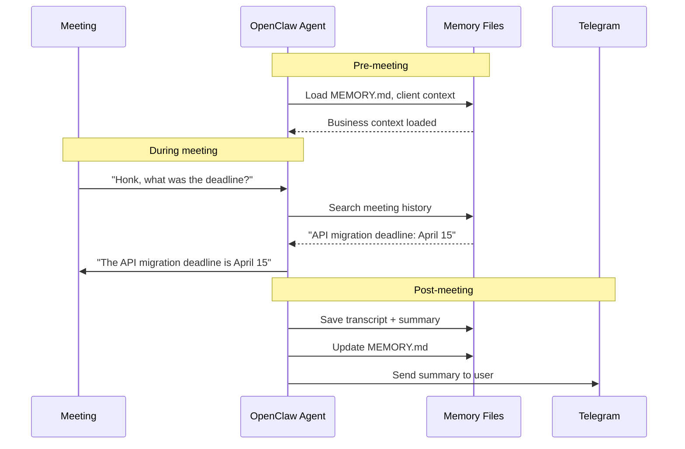

# OpenClaw Bridge Specification

Replace the direct Anthropic LLM in the Pipecat pipeline with an OpenClaw agent that has persistent memory, business context, and unified personality across channels.

---

## Problem

The current Pipecat pipeline uses `AnthropicLLMService` directly:

```python
llm = AnthropicLLMService(
    api_key=os.getenv("ANTHROPIC_API_KEY"),
    model="claude-opus-4-20250514",
)
```

This means:
- **No memory between meetings** — every meeting starts from scratch
- **No business context** — the bot doesn't know client names, project history, or preferences
- **Separate from Telegram agent** — meeting knowledge isn't available in Telegram and vice versa
- **No persistent personality** — SOUL.md and MEMORY.md aren't loaded into the pipeline

---

## Target Architecture

```
Meeting Audio → Deepgram STT → [OpenClaw Agent] → ElevenLabs TTS → Meeting Audio
                                      ↕
                              MEMORY.md + memory/
                              context/clients/
                              memory/meetings/
```

The OpenClaw agent replaces `AnthropicLLMService` as the "brain" of the pipeline. It handles:
- LLM routing (Claude Haiku for fast voice, Sonnet for complex reasoning)
- Memory retrieval (load relevant context before responding)
- Memory persistence (save meeting knowledge after responding)
- Personality consistency (SOUL.md defines Honk's meeting behavior)

---

## Implementation Approaches

### Option 1: HTTP Bridge (Recommended for v1)

Pipecat sends transcripts to OpenClaw via a local HTTP API and gets responses back.

```
Pipecat Pipeline                    OpenClaw Gateway
     │                                    │
     │  POST /api/chat                    │
     │  { transcript, speaker, context }  │
     │ ─────────────────────────────────► │
     │                                    │── Load MEMORY.md
     │                                    │── Load meeting context
     │                                    │── Call Claude with full context
     │  SSE: response tokens (streaming)  │
     │ ◄───────────────────────────────── │
     │                                    │── Save to meeting transcript
     │                                    │── Update memory if needed
```

**Pros:**
- Clean separation of concerns
- Pipecat doesn't need to know about OpenClaw internals
- OpenClaw handles all memory/context logic
- Streaming response via SSE for low latency

**Cons:**
- Extra HTTP hop adds ~10-20ms latency
- Need to implement an HTTP API endpoint in OpenClaw (or use existing session API)

### Option 2: Custom Pipecat LLM Service

Write a `PipecatLLMService` subclass that calls OpenClaw's session API instead of Anthropic directly.

```python
class OpenClawLLMService(LLMService):
    """Pipecat LLM service that routes through OpenClaw agent."""
    
    async def _process_context(self, context):
        # Send to OpenClaw session API
        # OpenClaw loads memory, calls Claude, returns response
        async for token in self._openclaw_session.chat(context):
            yield token
```

**Pros:**
- Integrates natively into Pipecat's pipeline architecture
- Pipecat handles streaming, interruption, context management
- Cleanest developer experience

**Cons:**
- Tighter coupling between Pipecat and OpenClaw
- Need to understand both Pipecat's and OpenClaw's session APIs

### Option 3: Webhook Approach

OpenClaw agent receives meeting events via webhooks, processes them, sends responses back.

**Pros:**
- Most decoupled architecture
- OpenClaw agent treats meetings like any other channel

**Cons:**
- Higher latency (webhook round-trip)
- More complex event routing
- Harder to handle streaming responses

### Recommendation

**Start with Option 1 (HTTP Bridge)** for simplicity, then migrate to Option 2 once the integration is proven. Option 1 can be built with minimal changes to either codebase.

---

## Wake Word: "Honk"

### Problem

The bot's name is "Honk" in meetings. It should **only respond** when someone says "Honk" or directly addresses it. Processing every utterance through the LLM wastes money and creates false triggers.

### Current State

The system prompt already includes: `Only respond when someone says your name`

But this relies on the LLM to self-filter, which:
- Still costs money per request (LLM processes every utterance)
- Can produce false triggers when the LLM "decides" to respond anyway
- Doesn't reduce Anthropic API costs

### Recommended: Transcript-Level Filtering

```python
# In the Pipecat pipeline, between STT and LLM:

class HonkWakeWordFilter(FrameProcessor):
    """Only pass transcripts to LLM when 'Honk' is detected."""
    
    WAKE_WORDS = ["honk", "hey honk", "honk assist"]
    
    async def process_frame(self, frame):
        if isinstance(frame, TranscriptionFrame):
            text = frame.text.lower()
            if any(word in text for word in self.WAKE_WORDS):
                # Pass to LLM — someone addressed Honk
                await self.push_frame(frame)
            else:
                # Silently consume — save LLM costs
                # Still log transcript for meeting notes
                self._transcript_buffer.append(frame)
```

**Cost savings:** If the bot is in a 1-hour meeting and participants speak for 40 minutes but only address Honk 10 times, transcript filtering reduces LLM calls from ~200+ (every utterance) to ~10 (only when addressed).

### Wake Word Strategy Comparison

| Approach | Cost | Latency | Accuracy | Complexity |
|----------|------|---------|----------|------------|
| LLM self-filtering | High (every utterance) | High | ~90% | Low |
| Transcript keyword scan | Low (only matches) | None | ~95% | Low |
| STT-level wake word (Picovoice) | Lowest | None | ~98% | Medium |
| Hybrid (keyword + LLM confirm) | Medium | Low | ~99% | Medium |

**Recommendation:** Start with transcript-level keyword scan. It's simple, effective, and dramatically reduces LLM costs. Add Picovoice or similar if false trigger rate is too high.

---

## Memory Integration

### Pre-Meeting Context Loading

When a meeting starts, the OpenClaw agent loads:

1. **MEMORY.md** — curated business knowledge
2. **Meeting history** — previous meetings with the same participants (if identifiable)
3. **Client context** — `context/clients/<client>.md` if the meeting is with a known client
4. **Project context** — `context/projects/<project>.md` if meeting topic is known
5. **Recent daily notes** — last 2-3 days of `memory/YYYY-MM-DD.md`

This gives Honk the ability to say things like: *"Last time we discussed the API migration — Bob had an action item to update the docs. Did that get done?"*

### During-Meeting Context

The OpenClaw agent maintains conversation context throughout the meeting:
- Full transcript buffer (for post-meeting processing)
- Active conversation context (last N utterances for LLM)
- Running list of decisions and action items detected

### Post-Meeting Processing

When the meeting ends:

1. **Save raw transcript** → `memory/meetings/YYYY-MM-DD-<title>.md`
2. **Generate summary** → Key decisions, action items, discussion points
3. **Update MEMORY.md** → Extract business-relevant information
4. **Update client/project context** → If applicable
5. **Send summary to user** → Via Telegram
6. **Create follow-up reminders** → For action items with deadlines

### Memory Flow Diagram



---

## Why This Matters

| Aspect | Direct AnthropicLLMService | OpenClaw Agent Bridge |
|--------|---------------------------|----------------------|
| Memory between meetings | ❌ None | ✅ Full persistent memory |
| Business context | ❌ Only system prompt | ✅ MEMORY.md + client files |
| Cross-channel knowledge | ❌ Isolated | ✅ Telegram + meetings unified |
| Learning over time | ❌ Static | ✅ Accumulates knowledge |
| Personality consistency | ❌ System prompt only | ✅ SOUL.md + memory shapes behavior |
| Cost optimization | ❌ Every utterance to LLM | ✅ Wake word filtering |
| Post-meeting processing | ❌ Manual | ✅ Automatic summary + memory update |

The OpenClaw agent bridge transforms Honk from a stateless voice bot into a **persistent meeting assistant** that gets smarter over time.

---

## Implementation Phases

### Phase 1: HTTP Bridge + Wake Word

- Implement local HTTP endpoint in OpenClaw for Pipecat
- Add transcript-level "Honk" wake word filtering
- Basic memory loading (MEMORY.md only)
- Post-meeting transcript saving

### Phase 2: Full Memory Integration

- Pre-meeting context loading (client + project files)
- During-meeting context enrichment
- Post-meeting summary generation and memory updates
- Telegram notification with meeting summary

### Phase 3: Custom Pipecat LLM Service

- Migrate from HTTP bridge to native Pipecat service
- Tighter streaming integration
- Interruption-aware memory updates
- Multi-speaker context tracking

---

## Related Specs

- [Meeting Bot Spec](meeting-bot.md) — MeetingBaas integration and pipeline details
- [OpenClaw Agent Spec](openclaw-agent.md) — Multi-agent configuration and memory architecture
- [Voice Pipeline Spec](voice-pipeline.md) — STT/TTS configuration details
