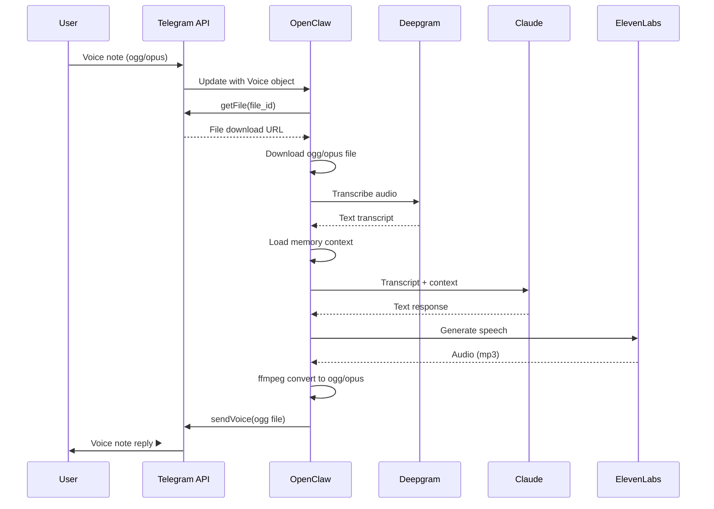

# Telegram Integration Specification

Telegram serves as the primary user interface for HonkAssist. Users interact via text messages, voice notes, and commands — all from their Android (or iOS/desktop) Telegram app.

---

## Why Telegram?

| Factor | Telegram | Signal (alternative) |
|--------|----------|---------------------|
| Voice message UX | ⭐⭐⭐⭐⭐ Native waveform player | ⭐⭐ File attachment |
| Bot API | ⭐⭐⭐⭐⭐ Official, stable | ⭐⭐ Unofficial (signal-cli) |
| Setup complexity | Low | High |
| Privacy | ⭐⭐⭐ Server-side encryption | ⭐⭐⭐⭐⭐ E2E encrypted |
| Reliability | High | Moderate (can break with updates) |
| Voice calls via bot | Not supported (not needed) | Not possible |

**Decision:** Telegram's native voice message support and official Bot API make it the clear winner. The privacy trade-off (server-side vs E2E encryption) is acceptable for a private 1:1 bot chat. See [Security Spec](security.md) for full privacy analysis.

---

## Bot Setup via @BotFather

### Creating the Bot

1. Open Telegram, search for **@BotFather**
2. Send `/newbot`
3. Enter a display name: `HonkAssist`
4. Enter a username: `honkassist_bot` (must end in `bot`)
5. Save the **bot token** (format: `123456789:ABCdefGHIjklMNOpqrSTUvwxYZ`)

### Recommended Bot Settings

Send these commands to @BotFather:

```
/setdescription - Voice-enabled AI meeting assistant
/setabouttext - I join your meetings, take notes, and answer questions. Send me a voice note or text message anytime.
/setuserpic - [upload avatar image]
/setcommands - Set the command menu:
  join - Join a meeting (send the link after)
  status - Check system status
  meetings - List recent meetings
  help - Show available commands
```

### Getting the User's Telegram ID

The end-user needs to find their Telegram user ID:

1. Search for **@userinfobot** in Telegram
2. Send any message
3. The bot replies with the user ID (numeric, e.g., `123456789`)

---

## OpenClaw Configuration

```json
{
  "channels": {
    "telegram": {
      "token": "<BOT-TOKEN>",
      "allowedUsers": ["<USER-TELEGRAM-ID>"],
      "mediaMaxMb": 20
    }
  }
}
```

| Field | Description |
|-------|-------------|
| `token` | Bot token from @BotFather |
| `allowedUsers` | Array of Telegram user IDs allowed to message the bot |
| `mediaMaxMb` | Max file size for media handling (voice notes, images) |

> **Security:** The `allowedUsers` array is the primary access control. Only listed user IDs can interact with the bot. All other messages are silently ignored. See [Security Spec](security.md#telegram-allowlist).

---

## Voice Message Handling

### Receiving Voice Notes

When the user sends a voice note in Telegram:



### Voice Format Requirements

**Receiving (user → bot):**
- Telegram sends voice notes as OGG with Opus codec
- Duration and file size included in the `Voice` object
- File ID used to download via Bot API

**Sending (bot → user):**
- Telegram requires OGG with Opus for native voice bubble display
- Conversion: `ffmpeg -i input.mp3 -ac 1 -acodec libopus -b:a 128k output.ogg`
- Max file size: 50 MB
- Must use `sendVoice` method (not `sendAudio`) for waveform display

### Voice Note Characteristics

| Property | Value |
|----------|-------|
| Input codec | OGG/Opus |
| Input sample rate | 48 kHz |
| Max duration | Unlimited (file size limited) |
| Output codec | OGG/Opus |
| Output bitrate | 128 kbps |
| Output channels | Mono |

---

## Text Message Handling

Text messages follow a simpler flow:

1. User sends text message
2. OpenClaw receives via Telegram plugin
3. Memory context loaded
4. Claude Sonnet generates response (text model, better reasoning)
5. Text reply sent back

No STT or TTS involved — faster response time (~1-2s).

---

## Meeting Join Command

### Command Flow

```
User: Join this meeting: https://meet.google.com/abc-defg-hij
Bot:  🔗 Joining Google Meet... I'll announce myself when I'm in.

[Bot joins meeting]

Bot:  ✅ I've joined the meeting. I'll send you a summary when it's over.

[Meeting ends]

Bot:  📋 Meeting Summary - Weekly Standup (45 min)
      
      Key Decisions:
      • Deployment moved to Monday
      
      Action Items:
      • Bob: API docs by Thursday
      • Alice: Review deployment checklist
      
      Full transcript saved.
```

### URL Detection

OpenClaw detects meeting URLs using pattern matching:

| Platform | Pattern | Example |
|----------|---------|---------|
| Google Meet | `meet.google.com/*` | `https://meet.google.com/abc-defg-hij` |
| Teams | `teams.microsoft.com/l/meetup-join/*` | `https://teams.microsoft.com/l/meetup-join/...` |
| Zoom | `zoom.us/j/*` | `https://zoom.us/j/123456789` |

### Commands

| Command | Description | Example |
|---------|-------------|---------|
| Send meeting URL | Join a meeting | `https://meet.google.com/abc-defg-hij` |
| `/join <url>` | Explicit join command | `/join https://zoom.us/j/123` |
| `/leave` | Leave current meeting | `/leave` |
| `/status` | Check bot status | `/status` |
| `/meetings` | List recent meetings | `/meetings` |
| `/summary` | Get last meeting summary | `/summary` |
| `/help` | Show commands | `/help` |

---

## Allowlist Security

### How It Works

Only Telegram user IDs listed in `allowedUsers` can interact with the bot:

- Messages from unlisted users are **silently ignored**
- No error message is sent (prevents information leakage)
- Blocked attempts can be logged for security monitoring

### Configuration

```json
{
  "channels": {
    "telegram": {
      "allowedUsers": ["123456789"]
    }
  }
}
```

### Adding Users

To add a new authorized user:

1. Get their Telegram user ID (via @userinfobot)
2. Add to `allowedUsers` array in `openclaw.json`
3. Restart OpenClaw: `sudo systemctl restart openclaw`

### Security Considerations

- User IDs are numeric and cannot be spoofed within Telegram
- The allowlist is the **primary access control** — all other security measures are secondary
- Bots cannot initiate conversations — users must send the first message
- See [Security Spec](security.md) for full threat model

---

## Error Handling

| Scenario | Bot Response |
|----------|-------------|
| Voice transcription fails | "Sorry, I couldn't understand that voice note. Could you try again or type your message?" |
| TTS generation fails | Falls back to text response |
| Meeting join fails | "I couldn't join that meeting. Please check the link and try again." |
| API rate limit | "I'm being rate limited. Please try again in a moment." |
| Unknown command | Treat as conversational message, respond naturally |

---

## Telegram API Methods Used

| Method | Purpose |
|--------|---------|
| `getUpdates` / webhook | Receive messages |
| `sendMessage` | Send text replies |
| `sendVoice` | Send voice note replies |
| `getFile` | Download voice notes from user |
| `sendChatAction` | Show "typing..." or "recording audio..." indicator |
| `setMyCommands` | Register bot commands |

### Chat Actions

To improve UX, the bot sends chat actions while processing:

- **Text processing:** `typing` action
- **Voice processing:** `record_voice` action while transcribing/generating, then `upload_voice` while sending

---

## Rate Limits

Telegram Bot API rate limits:

| Limit | Value |
|-------|-------|
| Messages to same chat | 1/second |
| Messages to different chats | 30/second |
| File upload | 50 MB max |
| File download | 20 MB max |

These limits are well within HonkAssist's usage patterns (single user, conversational pace).
